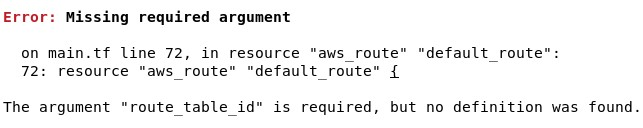
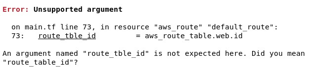
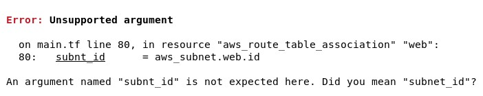
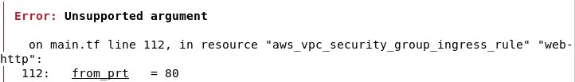
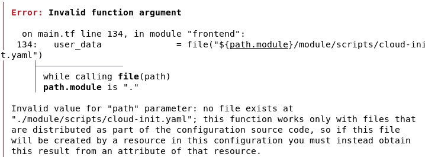
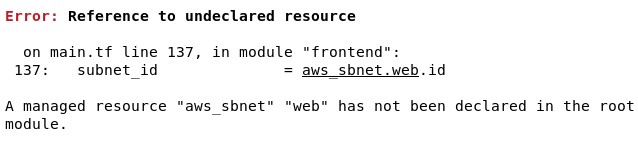

# makeUpLab

## Error 1

Fix: Corrected `route_tble_id` to `route_table_id`.

---

## Error 2

Fix: Same typo as Error 1 (`route_tble_id` → `route_table_id`).

---

## Error 3

Fix: Changed `subnt_id` to `subnet_id`.

---

## Error 4

Fix: Changed `from_prt` to `from_port`.

---

## Error 5

Fix: Corrected file path from `module/scripts/cloud-init.yaml` to `scripts/cloud-init.yaml`.

---

## Error 6

Fix: Changed `aws_sbnet.web.id` to `aws_subnet.web.id`.

---

## Final Result

Terraform `plan` and `apply` completed successfully after fixing all errors.
